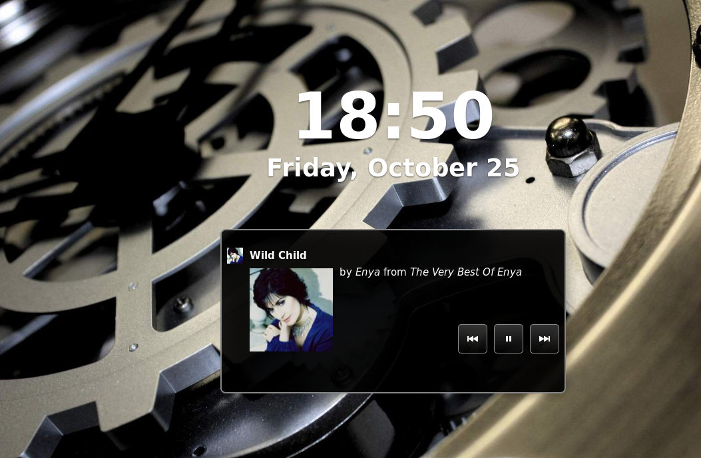

关于
====
kwplayer是一款运行在linux桌面的网络音乐播放器, 它使用
[酷我音乐盒](http://kuwo.cn) 的音乐资源.

经过测试, kwplayer可以在以下系统中运行:

* Debian sid
* Debian testing
* Debian whezy
* Ubuntu 14.10
* Ubuntu 14.04
* Ubuntu 13.10 Beta
* Ubuntu 13.04
* Ubuntu 12.10
* Ubuntu 12.04
* Gentoo
* Fedora 21
* Fedora 20
* Fedora 19
* Arch Linux

安装
====
制作好的各主要发行版的安装包(比如deb, rpm等)都放在了
[kwplayer-packages](https://github.com/LiuLang/kwplayer-packages),
请转到那里去下载.

使用技巧
========
* 在gnome-shell中, 可以安装mediaplayer这个扩展, 与kwplayer结合使用, 很方便.
可以在这里进行安装:
<https://extensions.gnome.org/extension/55/media-player-indicator/>
* 播放歌曲时把鼠标放到左上角的歌手头像上, 可以显示歌手的基本信息.
* 播放歌曲时双击左上角的歌手的头像可以在播放列表中定位正在播放的这首歌.
* 播放列表中的歌曲可以直接拖放到其它列表, 支持键盘操作, 比如Ctrl+A全选;
选择歌曲时按下Ctrl键可多选. 按Del键可以删除选中的歌曲.

Q&A
===
问: 为什么不能用它来打开/管理本地的音乐?

答: 没有必要. 因为Linux桌面已经有不少强大的音乐管理软件了, 像rhythmbox, audacity, amarok等, 干嘛要加入一些重复的功能?

问: kwplayer 中怎样代理上网?
答: 它使用系统默认的http代理. 比如在gnome桌面里,
打开"系统设置"面板 -> "网络" -> "代理", 选择"手动", 然后为http设置代理.
也可以在在终端中使用代理, 比如:
`$ export http_proxy="http://127.0.0.1:8080"; kwplayer`
就可以了.

问: 启动时出现这个错误(arch linux中), `Xlib.error.DisplayConnectionError: Can't connect to display ":0.0": b'No protocol specified\n'`
答: 因为Arch中启用了Host-based access, 默认情况下, 多媒体键是不可用的. 现在的
办法是关闭host-based acces, `$ xhost +`. 这个方法是@shmile提供的. 更多信息, 可以
参考<https://wiki.archlinux.org/index.php/Xhost>以及
<http://en.wikipedia.org/wiki/X_Window_authorization>

也可以将`xhost + >/dev/null` 这条命令加入到系统启动脚本中, 这样的话, 系统启动时
就会自动关闭Host-based access了.

问: 为什么在fedora和opensuse里面无法锁定桌面歌词?

答: 因为锁定桌面歌词, 要用到cairo的cairo_region_t这个类, 而python3-cairo这个
cairo的python3绑定已经有几年没更新了(最近一次是2011年), 所以它不太完整, 里面
缺少了Region类, 所以导致kwplayer在尝试锁定时就报错.

针对这个问题, 早在2012年就有人提交了bug并写了补丁, debian系的发行版都带有这个
补丁的, 所有不存在这样的问题; 而其它发行版并没有打入这个补丁.

要解决这个问题, 确实有些麻烦, 尤其是对一般用户来说.

补丁地址及bug报告的链接:

* https://bugs.freedesktop.org/attachment.cgi?id=61553
* http://bugs.debian.org/688079
* http://cgit.freedesktop.org/pycairo/commit/?id=75e82a1b3f495a3abbc78e50a5c66356d320fb15

截图
====
在gdm的锁屏界面也可以控制kwplayer:

播放列表:

MV:

桌面歌词:

其它:

版权
====
软件本身使用GNU General Public License v3协议发布, 协议内容请参看LICENSE文件.

本人不存储任何侵权的多媒体资源供网友下载, 软件中获取的网络资源, 包括但不限
于图片, 音频文件, 视频文件, 都来自于kuwo.cn这个网站, 因使用本程序引起的一
切侵权问题由使用者本人承担.

有任何问题, 请联系我: LiuLang <gsushzhsosgsu@gmail.com>
